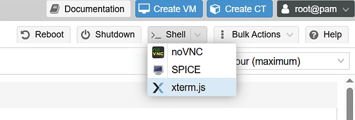

# **PROXMOX NUT INSTALLER**

On moving Guests into proxmox the UPS management tier needs to be managed by the Hypervisor to ensure all guests are shutdown successfully independent of the OS or if you are using VMs or LXCs.

To perform this we configure nut (Network UPS Tools) to shutdown the Proxmox host, and thus all Guests based on their configuration and shutdown order set in Proxmox, ensuring a safe termination of services.

This script is configured to work with SNMP based UPS. This is typically what you would find in a datacentre or where multiple hosts are used. Using the network instead of USB connections, allows them to be accessed by multiple hosts easily.

I have automated this process to a simple download script, so it can be added to any Proxmox 8 or 9 host relatively quickly.

This script has been tested with the standard APC SNMP Management cards, but any UPS that is supported by the nut-snmp driver should work fine.


## **Installing nut**

Login the Proxmox Web GUI ```http://<IPADDRESS>:8006```

Launch a shell terminal. I recommend using the xterm.js type.



Run the following commands, with your UPS configuration options on the ```./nutinstall.sh``` commandline

```
wget https://raw.githubusercontent.com/steven-geo/proxmox-nut/refs/heads/master/nutinstall.sh
chmod +x nutinstall.sh
./nutinstall.sh -a <UPSIPADDRESS> -c <SNMPCOMMUNITY>
```

If not specified, the script will configure the SNMP as public.

A Password can also be configured when running the ```nutinstall.sh``` script, however it is recommended not to parse a password on the commandline. The script will automatically generate a 24 character password for nut. This can then be copied later if you want to change the LISTEN options and have remote access to the nut server. This is out of scope for this implementation.


The below is the output of running the script.

If there are any other options you want to set you can now set them.

NOTE: Running the nutinstall script again will overright all configuration options.

## **Example Output of running the nut install script**

```
root@pve-testing:~# wget https://raw.githubusercontent.com/steven-geo/proxmox-nut/refs/heads/master/nutinstall.sh
--2025-11-02 21:12:48--  https://raw.githubusercontent.com/steven-geo/proxmox-nut/refs/heads/master/nutinstall.sh
Resolving raw.githubusercontent.com (raw.githubusercontent.com)... 
Connecting to raw.githubusercontent.com (raw.githubusercontent.com)|:443... connected.
HTTP request sent, awaiting response... 200 OK
Length: 2217 (2.2K) [text/x-sh]
Saving to: ‘nutinstall.sh’

nutinstall.sh            100%[================================>]   2.17K  --.-KB/s    in 0s      

2025-11-02 21:12:48 (31.1 MB/s) - ‘nutinstall.sh’ saved [2217/2217]

root@pve-testing:~# chmod +x nutinstall.sh
root@pve-testing:~# ./nutinstall.sh -a 192.168.1.22
Downloading Configuration...
--2025-11-02 21:13:00--  https://raw.githubusercontent.com/steven-geo/proxmox-nut/refs/heads/master/nutconfig.tar.gz
Resolving raw.githubusercontent.com (raw.githubusercontent.com)... 
Connecting to raw.githubusercontent.com (raw.githubusercontent.com)|:443... connected.
HTTP request sent, awaiting response... 200 OK
Length: 1518 (1.5K) [application/x-gzip]
Saving to: ‘nutconfig.tar.gz’

nutconfig.tar.gz         100%[================================>]   1.48K  --.-KB/s    in 0s      
2025-11-02 21:13:01 (57.4 MB/s) - ‘nutconfig.tar.gz’ saved [1518/1518]

./nut/
./nut/nut.conf
./nut/ups.conf
./nut/upsd.conf
./nut/upsd.users
./nut/upsmon.conf
./nut/upssched-cmd
./nut/upssched.conf
Configuring NUT
  UPS IP Address = 192.168.1.22
  UPS SNMP Community = public
  NUT Password = ***********
Reading package lists... Done
Building dependency tree... Done
Reading state information... Done
The following NEW packages will be installed:
  nut nut-snmp
0 upgraded, 2 newly installed, 0 to remove and 0 not upgraded.
...                                                                               
Nut successfully configured
root@pve-testing:~# 
```


## **Conclusion**

I hope this helps someone, there are a couple of guides on configuring proxmox for USB based UPS, but not for SNMP, and nothing scripted and repeatable.

If you would like to clone the repo to make your own changes, or host this yourself, here is the direct link.

This content is also available on my blog 
(https://blog.hardtechnology.net/post/proxmox-nut/)
